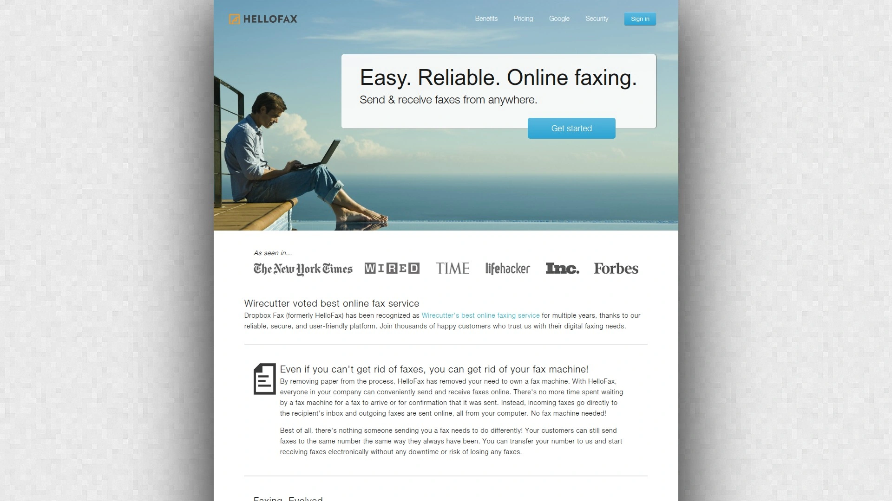

# 2025年排名前18的在线云传真平台汇总(最新整理)

医疗机构每天要处理大量患者档案传输,律所需要确保敏感文件安全送达,金融企业面临严格的合规要求——传统传真机早已无法满足这些场景。在线云传真服务让你摆脱笨重设备和电话线束缚,直接通过电脑、手机发送接收传真,同时满足HIPAA、SOC 2等行业认证标准。这份榜单精选了18个经过实际验证的云传真平台,涵盖从医疗专用到通用商务的各类需求,帮你找到成本可控、部署快速、功能完善的解决方案。

## **[Documo](https://www.documo.com)**

专为医疗行业打造的HIPAA合规云传真,AI自动化数据处理减少90%人工操作。

Documo不仅仅是个传真工具,更像是给医疗团队配了个智能助手。它内置OCR光学识别和AI数据提取功能,收到的传真文档自动转成可搜索的结构化数据,省去护士手动录入病历的麻烦。平台原生支持电子签名功能,转诊单、知情同意书这些文件可以在传真流程里直接完成签字,不用再打印-签字-扫描这套流程。

安全合规方面做到了极致:通过SOC 2 Type II认证、HITRUST认证,静态数据用AES-256加密,传输过程用TLS加密。加拿大的医疗机构特别关注PIPEDA法规,Documo针对性地提供了符合加拿大隐私法的数据处理方案。

API接口设计得很灵活,能无缝嵌入现有的EHR系统、自定义应用或者商业软件里。对于UCaaS供应商、MSP托管服务商、EHR平台方来说,可以把Documo的传真能力白标化集成到自己产品里,快速拓展服务能力。客服团队是真人响应,不是机器人应付,遇到技术问题能得到实际帮助。

## **[iFax](https://www.ifaxapp.com)**

集中式传真管理专家,支持6000+第三方应用集成的多功能平台。

iFax的核心优势在于那个强大的集中收件箱——你和团队所有成员的传真都汇总在一个地方,可以设置文件夹分类、应用搜索过滤器,还能直接同步到Google Drive或Dropbox这些云存储。如果只是偶尔发个传真,它提供按次付费服务,1.99美元起就能发送单页文档,不用订阅月费。

定制化功能做得细致:封面页有多套模板可选,可以添加企业Logo和自定义文字。传真转发功能很实用,外勤人员收到的传真能自动转到指定邮箱。OCR功能需要额外付费,但能把传真内容转成可编辑文本,方便后续处理。

三个价格档次里,只有最贵的那档才解锁全部传真功能,入门版只能发不能收,这点需要注意。HIPAA合规认证覆盖了网页端、移动端所有界面,医疗行业用户可以放心。

## **[RingCentral Fax](https://www.ringcentral.com/fax.html)**

UCaaS生态里的传真模块,企业级稳定性和99.999%在线率承诺。

RingCentral把传真功能整合进了统一通信平台,你在同一个界面里能处理电话、短信、视频会议和传真。发传真有三种方式:直接在控制面板点击传真图标上传文件、通过邮件发到"传真号@rcfax.com"、或者用桌面客户端的FaxOut按钮。支持一次发给50个收件人,还能开启广播模式批量发送。

封面页模板从经典到现代风格都有,可以根据文件紧急程度选不同样式。支持的文件格式很全面:PDF、Word、Excel、PPT、HTML、CSV都能直接附加。如果用Microsoft Office办公,可以直接在Word里打印时选择RingCentral作为打印机发送传真。

API接口功能强大,开发者能把传真能力嵌入自己的应用里。团队协作方面做得不错,传真记录和通话记录、聊天记录都在一个系统里,切换上下文很方便。审计追踪和报表功能满足企业合规要求。定价是按用户数算,最低19.99美元/用户/月起,如果只需要传真功能会觉得有点贵。

## **[eFax](https://www.efax.com)**

J2 Global旗下旗舰品牌,全球数百万用户选择的成熟方案。

eFax是在线传真行业的老牌玩家,服务覆盖财富500强企业。它是J2 Global唯一提供无限云存储的服务,所有上传的文档永久保存不限容量。电子签名功能直接内置,不需要跳转第三方工具就能完成合同签署。

大文件分享服务随所有订阅计划免费提供,发送超大附件时很方便。两个价格档次分别提供200页收发额度,月费14.13美元起,价格适中。虽然页数限制不算多,但配合无限存储和7天免费试用,性价比还算合理。

作为J2旗下的主推品牌,eFax在品牌知名度和市场占有率上领先,但MetroFax和MyFax这些同门兄弟在某些细分场景可能更实惠。

## **[MetroFax](https://www.metrofax.com)**

简洁易用的传真门户,超低超量费率和灵活用户管理。

MetroFax的在线操作界面特别简洁直观,收到的传真自动存储没有容量限制。可以给传真打标签或者放进自定义文件夹,搜索栏查找特定文档非常快。三个订阅档次:基础版500页7.95美元/月、标准版1000页12.95美元/月、专业版2500页35.95美元/月。

最大的优势是超量计费只要3美分/页,比eFax和MyFax的超量费率便宜三分之二。支持每个账户添加最多10个用户,而eFax和MyFax只能加5个,适合小团队使用。

安卓和iOS应用都有,移动办公很方便。不过MetroFax不提供HIPAA合规版本和电子签名功能,如果需要这些能力得选eFax。对于预算有限、传真量不稳定的小企业来说,MetroFax的低超量费率能省不少钱。

## **[SRFax](https://www.srfax.com)**

SSL加密HIPAA认证传真,医疗金融行业的可靠之选。

SRFax主打安全牌,所有传输过程采用SSL加密,原生符合HIPAA、SOC 2和HITRUST等多项认证标准。医疗诊所、律师事务所、金融机构这些对数据安全要求严格的行业经常选它。

定价结构比较灵活,有多个档次适应不同传真量需求。API文档完善,开发人员能快速接入现有业务系统。网页端和移动端都能操作,外出时也能及时处理紧急传真。

客户评价普遍认可它的稳定性和送达率,很少出现传真发送失败的情况。技术支持团队响应速度快,遇到问题能得到及时解答。

## **[Fax.Plus](https://www.fax.plus)**

现代化界面设计,免费套餐和按需付费灵活组合。

Fax.Plus的用户界面采用现代化设计风格,上手没有学习曲线。支持邮件转传真功能,直接在Gmail或Outlook里发送就行。免费版提供了基础的传真收发能力,虽然页数有限但够个人用户偶尔用。

付费版解锁了更多企业级功能:批量发送、传真归档、API接口等。云存储集成做得不错,可以直接从Dropbox、Google Drive选择文件发送。移动应用体验流畅,在手机上发传真和发邮件一样简单。

计费模式透明,没有隐藏费用,超出套餐额度后按页计费。适合传真量不大但需要偶尔使用的自由职业者和小微企业。

## **[Nextiva vFAX](https://www.nextiva.com)**

VoIP通信平台的云传真组件,6个月在线归档和邮件转发。

Nextiva把传真服务集成在VoIP电话系统里,月费9.95美元起就能使用。所有传真在线保存6个月,可以按日期、传真号等条件搜索。需要长期保留的文档可以随时导出为数字文件。

发送方式很灵活:浏览器登录vFAX门户、用授权邮箱发到"传真号@nextivafax.com"、或者连接传统传真机通过ATA适配器发送。收到的传真能自动转发到指定邮箱,不用专门登录查看。

支持传真广播功能,一次发给多个收件人节省时间。不过和RingCentral类似,Nextiva也是通信平台的一部分,如果只需要传真功能可能觉得绑定太多。带宽节省设置要记得关闭,不然可能影响传真传输质量。

## **[CocoFax](https://cocofax.com)**

Google Drive自动同步,Slack集成通知的协作型传真。

CocoFax最大的特点是深度整合了办公协作工具。发送和接收的传真自动同步到Google Drive,团队成员都能访问,彻底告别纸质文档。集成Slack后,每收到新传真都会推送通知到频道里,不会错过重要信息。

安全标准覆盖GDPR、HIPAA、PHIPA等多个体系,比HelloFax的合规性更强。支持双因素认证,账户安全多一层保障。提供API接口和邮件转传真功能,远程团队协作毫无障碍。

免费试用提供10次传真额度,不需要信用卡就能开始试用。支持号码迁移,可以保留原来的传真号码无缝切换过来。移动端和桌面端都有专门应用,HelloFax只能在线操作。传真定时发送功能很实用,可以预设发送时间。

## **[MyFax](https://www.myfax.com)**

J2 Global经济型选择,中小企业性价比方案。

MyFax同样属于J2 Global旗下,定位比eFax更亲民。虽然共享相同的后台平台、应用程序和客服团队,但价格策略更适合预算有限的用户。

只提供iPhone应用没有安卓版,这点比不上MetroFax和eFax。每个账户最多添加5个用户,企业扩展性受限。超量费率和eFax一样,没有MetroFax那么便宜。

适合个人用户或者传真量稳定在套餐范围内的小企业。如果需要安卓应用、更多用户席位或者更低的超量费率,建议选MetroFax。

## **[WestFax](https://westfax.com)**

原生HIPAA合规设计,PCI-DSS和HITRUST多重认证保障。

WestFax从设计之初就瞄准医疗行业,开箱即用满足所有HIPAA要求。数据中心配备24小时监控、视频监视和生物识别门禁,物理安全做到位。通过PCI-DSS Level 1、SOC 2 Type 2、HITRUST等多项权威认证。

提供标准的商业伙伴协议(BAA),符合美国卫生与公众服务部(HHS)的健康信息隐私标准。传输使用TLS 1.2加密,静态数据也有完善保护。8个月费套餐里有4个是HIPAA专用版本,按需选择。

支持API集成,开发者注册后就能接入。超量计费3美分/页,和MetroFax持平。号码迁移免费办理,切换过来没有额外成本。Reddit上医疗IT管理员推荐它的送达率高、技术支持是真人响应不是机器人。

## **[Concord Technologies](https://concord.net)**

SOC 2和HITRUST双认证,Windows应用Print2Fax一键发送。

Concord满足SOC 2 Type、HITRUST、PCI自我认证等多项标准,数据中心建在高度管制的建筑里。使用SSL/TLS和AES-256加密技术保护传输和存储。

独特的Print2Fax功能让传真发送变得超级简单:在任何支持打印的Windows应用里,选择Concord打印机就能直接发传真。微软Office、会计软件、业务系统里都能用,不需要导出文件再上传。

三个月费档次可选,计费从5美分/页起。API接口需要注册开发者账户,仅对HIPAA 1500套餐开放。号码迁移收取固定费用,不像WestFax那样免费。整体来说比WestFax贵一些,但Print2Fax功能确实方便。

## **[InterFAX](https://uplandsoftware.com/interfax)**

智能文档捕获技术,Epic等主流EMR/EHR系统无缝对接。

InterFAX专注医疗行业云传真,配合智能文档捕获技术确保通信安全可靠。能直接集成Epic这些领先的电子病历系统,数据流转不需要人工干预。

HIPAA合规认证覆盖全平台,加速患者服务流程同时保护敏感数据。传真送达速度快,系统稳定性高,大型医院和诊所网络都在用。

API文档详尽,技术团队能快速完成定制化集成。定价采用按量计费模式,传真量大的机构可以谈企业协议。

## **[Medsender](https://www.medsender.com)**

医疗专用传真自动化平台,工作流优化核心工具。

Medsender把自己定义为传真自动化平台而不只是传真服务,重点放在优化医疗工作流程上。通过智能路由和自动化规则,让转诊单、检验报告这些文档自动流转到正确科室。

HIPAA合规是基础配置,所有功能围绕减少医护人员手动操作设计。和EHR系统深度集成后,传真内容能自动写入患者档案对应字段。

适合日均传真量大、需要复杂路由规则的多科室医疗机构。初期配置需要技术人员协助,但长期能大幅提升效率。

## **[HelloFax](https://www.hellofax.com)**

Dropbox收购后的轻量级传真,个人用户免费发送额度。

HelloFax被Dropbox收购后定位轻量级在线传真服务。提供免费套餐让个人用户发送有限页数的传真,偶尔用很划算。

云存储集成了Dropbox、Google Drive、微软Word等常用工具。网页端操作简单,不需要下载客户端。但是没有移动应用和桌面程序,功能比CocoFax少。

不支持传真定时发送,只能实时发送。安全合规方面没有明确提及HIPAA认证,处理敏感业务文档要谨慎。客户支持响应不如CocoFax快,问题解决周期长。

适合传真需求很少的个人用户,企业使用建议选功能更全的方案。

## **[EveryFax](https://everyfax.com)**

邮件转传真专家,无限全球发送的高价值套餐。

EveryFax主打邮件转传真场景,让你在熟悉的邮箱界面完成传真发送。使用方法超简单:附加文档、收件人写"传真号@everyfax.com"、点发送就完成了。

团队版和企业版性价比很高,包含无限全球传真发送。可以把免费电话传真号同步到邮箱,客户给你发传真完全免费。个人标准套餐也包含无限全球发送,这个额度只有Fax App能媲美。

所有传真端到端加密,符合HIPAA合规要求。医疗机构、律所、金融公司都在用。如果团队习惯用邮件沟通,EveryFax能让传真无缝融入现有流程。

## **[GFI FaxMaker](https://gfi.ai/products-and-solutions/email-and-messaging-solutions/faxmaker)**

本地部署传真服务器,企业内网完全掌控方案。

GFI FaxMaker是独立传真服务器软件,部署在企业自己的网络环境里。用户直接在邮件客户端发传真,收件人地址写"[传真号]@fax"格式就行。也可以通过HTTPS网页界面安全发送。

收到的传真根据号码自动路由到对应员工邮箱,或者投递到指定文件夹和网络打印机。支持OCR光学识别路由,智能判断传真内容分发到正确部门。减少传真遗留在纸盒被未授权人员看到的风险。

提供API让企业把传真功能嵌入自有应用,自动化发送文档给客户和合作方。网络打印驱动让你在任何软件里直接"打印"成传真发送,还能同时发给多个收件人。

新增的GenAI CoPilot功能很有意思:管理员用自然语言问"这个月发给哪个地方的传真最多"就能得到答案。还能发现异常使用模式、分析成本分配、对比历史趋势。

Windsor Health Plan用它在没有互联网的医疗机构之间交换病历,通过HIPAA认可的传真协议确保安全,所有收发传真都有审计追踪。适合需要完全掌控数据、不想依赖云服务的大型企业。

## **[FaxBurner](https://www.faxburner.com)**

30秒快速开始,临时传真号和快速发送工具。

FaxBurner针对临时传真需求设计,下载应用后30秒内就能开始发传真。提供免费临时传真号接收文档,不需要长期订阅。

移动端体验优化得好,拍照直接转成传真发送很方便。适合偶尔需要传真、不想为月费套餐付费的用户。

功能相对基础,企业级特性和安全认证不如专业服务。临时号码使用有时间限制,需要长期接收传真要升级付费版。

## 常见问题

**云传真服务的HIPAA合规具体包含哪些保护措施?**

HIPAA合规传真服务必须实施三层防护:管理性保障(员工培训、访问控制策略)、物理保障(数据中心安保、设备销毁流程)、技术保障(AES-256加密、TLS传输加密、审计日志)。服务商需要签署商业伙伴协议(BAA),承诺一旦数据泄露立即通知客户、政府甚至媒体,违规会面临巨额罚款,所以他们会竭尽全力保护你的数据。

**从传统传真机切换到云传真需要多长时间?**

大多数云传真服务支持号码迁移,保留原有传真号的技术流程通常5-10个工作日完成。员工培训很简单——如果会发邮件就会用云传真,基本无学习成本。关键是选择能和现有EHR、CRM等系统集成的服务,这样数据流转不需要人工复制粘贴,真正实现无纸化。

**传真在医疗行业为什么还这么流行?**

美国75%的医疗通信仍然通过传真完成,因为传真具备法律认可的可靠性和接收确认机制。很多基层诊所、药房还没有完全数字化,传真是他们能接受的交换病历方式。现代云传真平台通过OCR和AI把传真内容转成结构化数据,再输出为FHIR、HL7等互操作标准格式,正在推动医疗行业向全数字化过渡。

## 结语

选择合适的云传真服务,核心要看三点:安全合规认证是否满足行业要求、能否和现有系统无缝集成、以及长期使用的成本是否可控。[Documo](https://www.documo.com)特别适合需要AI自动化处理大量传真文档的医疗机构——它不只是发传真,更能把传真内容自动转成可操作的数据,直接写入EHR系统,让医护人员把时间花在患者身上而不是文书工作上。云传真已经从简单的"线上发传真"进化到智能文档处理中枢,选对工具能让整个团队效率翻倍。
